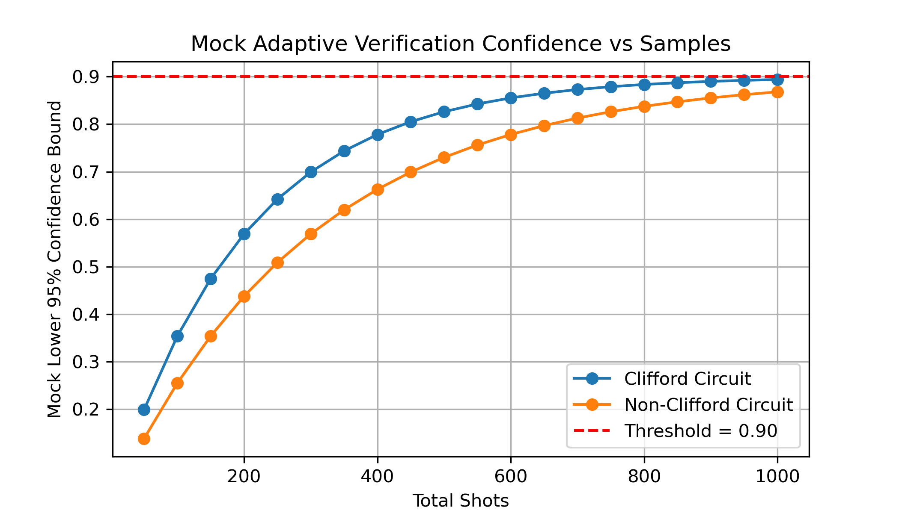

# 🧮 Quantum Clifford Verification

[](https://python.org)
[](https://en.wikipedia.org/wiki/Quantum_computing)
[](https://en.wikipedia.org/wiki/Adaptive_sampling)

> **Adaptive statistical protocol for distinguishing Clifford and non-Clifford quantum gates using randomized benchmarking and machine learning classification techniques.**

## 🔬 Quantum Verification Science

**Quantum circuit verification** is crucial for validating the performance of near-term quantum devices. This simulation explores:

- **🎯 Adaptive Protocols**: Statistical confidence bounds that tighten with increasing measurement samples
- **🔄 Randomized Benchmarking**: Clifford group properties for efficient quantum process tomography
- **📊 Confidence Intervals**: Wilson score intervals for robust fidelity estimation under finite sampling
- **🧠 Circuit Classification**: Machine learning approaches to distinguish gate set properties

### **Statistical Framework**:
The confidence bound follows the **Wilson score interval**:

## Implementation Details

The simulation uses a mock lower bound function that models the Wilson confidence interval:
```python
lb = fidelity * (1 - exp(-shots/decay))
```

Where:
- `fidelity` represents the true circuit fidelity (0.9 in this simulation)
- `decay` controls the convergence rate (200 for Clifford, 300 for Non-Clifford)
- `shots` is the cumulative number of measurement samples

## Parameters

- **Confidence Threshold:** 0.90
- **Sampling Strategy:** 50 shots per iteration
- **Maximum Samples:** 1000 shots (20 iterations)
- **Circuit Types:** Clifford (faster convergence) and Non-Clifford (slower convergence)



## How to Run

```bash
conda activate qc-env
jupyter lab
```